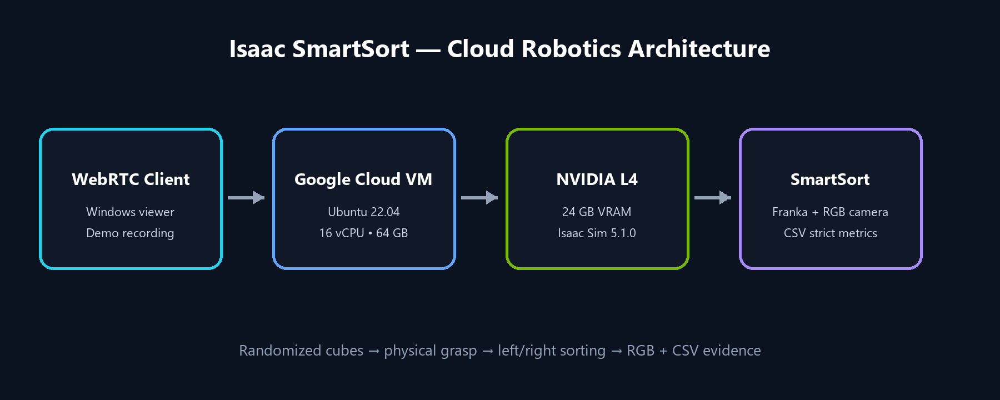
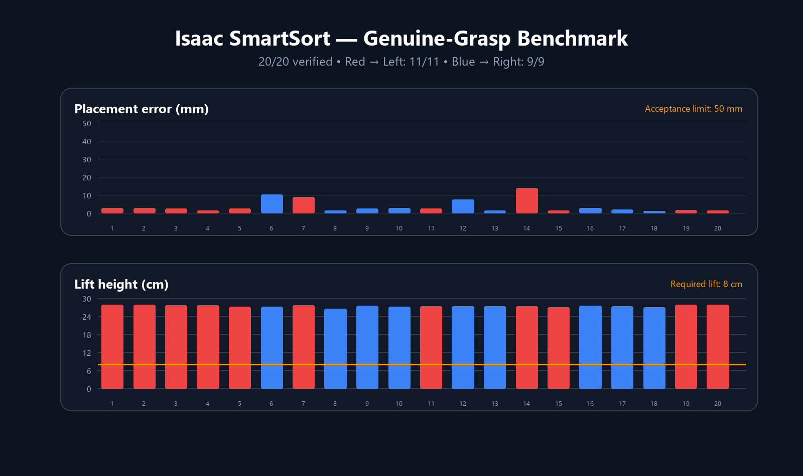

# Isaac SmartSort

**Cloud-Based Vision-Guided Robotic Sorting Digital Twin**

Isaac SmartSort is a portfolio-ready NVIDIA Isaac Sim 5.1.0 project running on a Google Cloud NVIDIA L4 instance. A Franka robot sorts randomly positioned red and blue cubes into color-coded bins, captures RGB camera output, and records reproducible grasp metrics.



## Validated result

The strict benchmark accepts a trial only when the controller finishes, the gripper closes on the object, the cube is lifted by at least 8 cm, and the final horizontal placement error is no more than 5 cm.

| Metric | Strict result |
|---|---:|
| Genuine grasp successes | **20/20 (100%)** |
| Red to left bin | **11/11** |
| Blue to right bin | **9/9** |
| Average lift height | **0.2741 m** |
| Lift range | 0.2647??.2791 m |
| Average placement error | **0.0037 m** |
| Maximum placement error | **0.0139 m** |
| Observed failures | **0** |



Raw evidence: [`results/smartsort-20260817-113415-strict-20.csv`](results/smartsort-20260817-113415-strict-20.csv). Trial 14 produced the largest error (13.9 mm), still comfortably within the 50 mm acceptance threshold.

## Features

- Franka pick-and-place control in Isaac Sim 5.1.0
- Randomized object position and red/blue sorting class
- Genuine-grasp validation using controller, gripper, lift, and placement signals
- RGB scene camera with start/final frame export
- Optional camera-frame capture for a 60??0 second demo video
- CSV evidence suitable for regression tests and portfolio charts
- Headless NVIDIA L4 deployment with WebRTC streaming

## Run the benchmark

The project is mounted at `/workspace/isaac-smartsort` in the Isaac Sim container.

```bash
SMARTSORT_TRIALS=20 ./python.sh /workspace/isaac-smartsort/smartsort_demo.py
```

## Capture the demo

Capture one complete randomized pick-and-place sequence as RGB frames:

```bash
SMARTSORT_TRIALS=1 SMARTSORT_CAPTURE_VIDEO=1 \
  ./python.sh /workspace/isaac-smartsort/smartsort_demo.py
```

Encode the captured frames on the host. Adjust the input frame rate so the final clip stays between 60 and 90 seconds.

```bash
ffmpeg -y -framerate 4 \
  -i ~/isaac-smartsort/results/video_frames/frame-%04d.png \
  -c:v libx264 -pix_fmt yuv420p -vf scale=1280:720 \
  ~/isaac-smartsort/results/isaac-smartsort-demo.mp4
```

Generated RGB stills are written to `results/rgb-scene-start.png` and `results/rgb-scene-final.png`. The MP4 and raw frame directory are ignored by Git to keep the repository lightweight; publish the MP4 as a GitHub Release asset or link to an external video.

## Repository layout

```text
isaac-smartsort/
???€ smartsort_demo.py       # scene, control, camera, validation, CSV output
???€ media/                  # README architecture and benchmark graphics
???€ results/                # versioned benchmark evidence
???€ .gitignore
???€ LICENSE
???€ README.md
```

## Environment

- Google Cloud Compute Engine `g2-standard-16`
- NVIDIA L4, 24 GB VRAM
- Ubuntu 22.04 LTS
- NVIDIA Isaac Sim 5.1.0 container
- Python 3 / Isaac Sim APIs

## Design notes

- The controller uses a validated z=0 work plane; the visible table body sits beneath that plane.
- A fixed random seed makes benchmark results reproducible.
- ROS 2 and a physical JetCobot are intentionally outside this milestone. The standalone simulation does not depend on the ROS 2 Bridge warning shown during startup.

## Roadmap

1. Publish the 60??0 second RGB-camera demonstration.
2. Add semantic segmentation and synthetic-data annotations.
3. Add automated regression checks for multiple physics seeds.
4. Integrate ROS 2 topics and physical hardware when available.

## License

MIT License. See [`LICENSE`](LICENSE).

